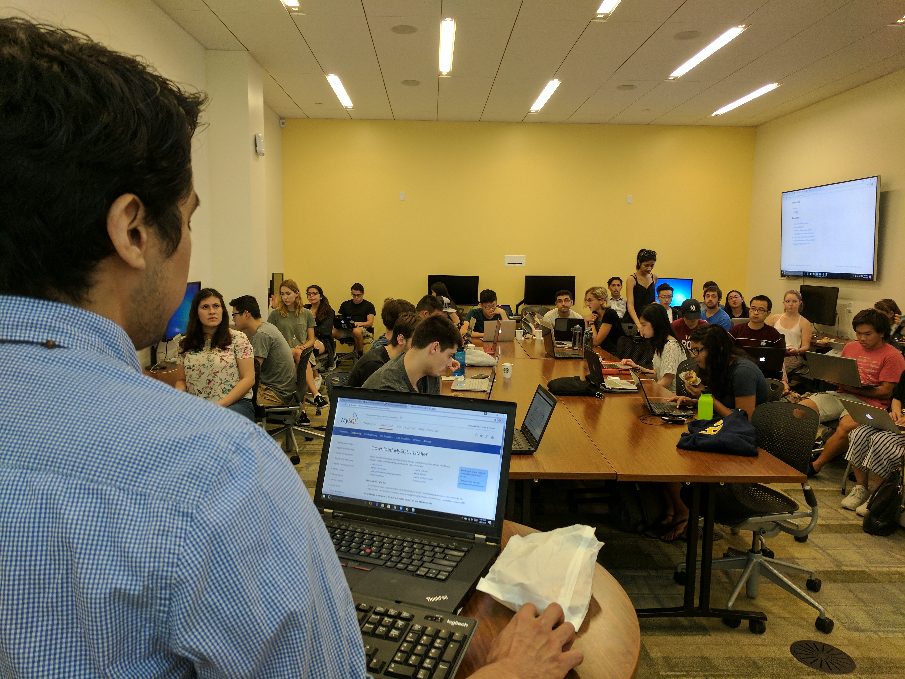
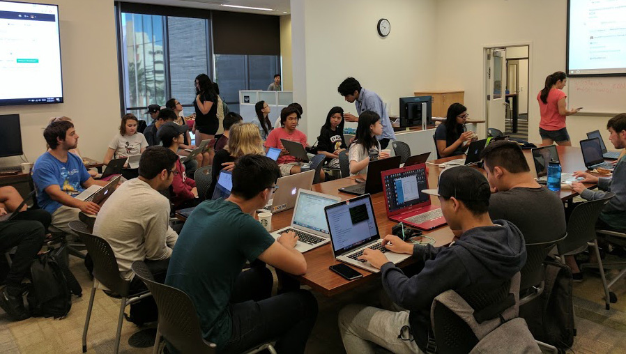
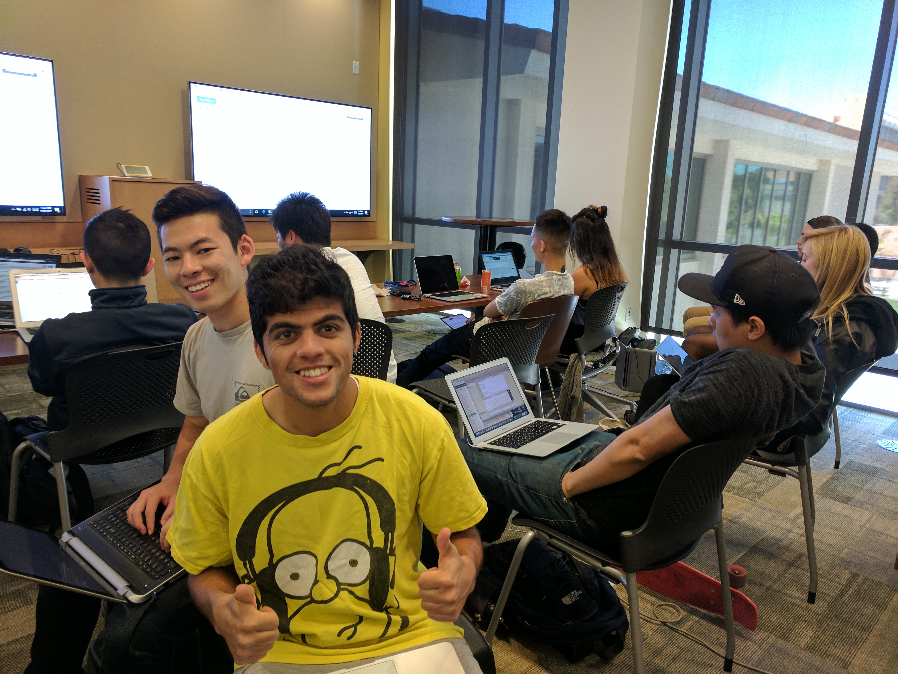

# UCSB Data Science and FACTOR Host Successful SQL Workshop
###### Jonathan Hsu
###### May 24, 2017

This past Saturday (May 20th, 2017) UCSB Data Science and the Female Actuarial Organization (FACTOR) came together to host a SQL workshop. The event began at 9:30 a.m., ending sometime around 1 p.m. in the afternoon. The event witnessed a successful turnout, as the collabratory was packed full of attendees before the event began. For those who are unfamiliar, SQL (Structured Query Language) is a programming language used in database management systems. Raul Eulogio, who does data work at the Hospice of Santa Barbara, led the workshop, guiding attendees through the concepts of SQL.

In the workshop, attendees learned SQL concepts necessary in utilizing MySQL, a database management system. Attendees were provided with hands-on data, which was utilized in learning the examples for SQL. Raul provided a live demonstration of SQL for the attendees, as he worked through each action and line of code. Progressing through the workshop, Raul demonstrated the significance of using SQL by applying it through an example using MySQL, a database management system. Using SQL, Raul touched on concepts like SQL Join, providing guidelines for analyzing the data on MySQL. Raul hoped that all attendees would be leaving the workshop with an understanding of SQL, having an extra tool available to present on their resumes. After Raul completed his walkthrough of useful SQL concepts, attendees were released and encouraged to form groups, as they prepared to work on various assignments that tested their understanding of SQL concepts, in the context of using MySQL. This next segment of the workshop saw attendees engaging in group work, tackling the assignments presented. For those struggling, Data Science officers were available on hand, assisting anyone who had trouble.

For more information regarding SQL applications, check out [this project](https://www.inertia7.com/projects/5) on inertia7.com, a three-part guide created by Raul himself.

 In this modern age, having an understanding of SQL is a handy tool for any company that has to deal with databases. And as if the prospect of learning a new tool through a quick workshop was not appealing enough, refreshments like donuts and coffee were made available to the attendees. Not only was spending a little of a Saturday learning a tool like this beneficial in the long run, but attendees were able to make new friends as well. Regardless, with a growing demand for hard skills, efficient workshops like this will be something you do not want to miss in the future. For those interested in workshops like this, make sure to like [UCSB Data Science](https://www.facebook.com/DataScienceUCSB/) on Facebook for news on upcoming workshops and events.

For those who were unable to attend the workshop, or for those who want to learn more, [here](https://github.com/raviolli77/SQL_Workshop) is the link to the GitHub holding the files utilized in the workshop
